# Benutzerdokumentation

Diese Dokumentation erklärt die Bedienung der Wiegestation in einfacher Sprache. Sie brauchen dafür kein technisches Vorwissen. Alle beschriebenen Schritte basieren auf dem tatsächlichen Verhalten der Programme und den vorhandenen Bildschirmfotos.

## 1. Wofür das System gedacht ist

Mit dem System können Sie:

- Teilnehmer in einer Liste suchen und auswählen
- Teilnehmer per QR-Code finden
- Gewicht aufnehmen und übernehmen
- Teilnehmerdaten prüfen und ändern
- neue Teilnehmer anlegen
- Teilnehmer löschen
- Kameras für QR-Scan und Waage auswählen

Wichtig: Änderungen werden direkt in der ausgewählten Teilnehmerdatei gespeichert.

## 2. Was Sie vor dem Start brauchen

Für einen reibungslosen Ablauf sollten folgende Dinge bereitstehen:

- eine Teilnehmerdatei im Format `.json`
- eine Kamera für den QR-Scan oder ein QR-Handscanner
- eine Kamera für die Waage
- freie Kameras, die nicht gerade von einem anderen Programm benutzt werden

Wenn eine Kamera schon von einem anderen Programm geöffnet ist, kann die Wiegestation sie nicht verwenden.

## 3. Schnellstart

1. Starten Sie die bereitgestellte Anwendung der Wiegestation.
2. Wählen Sie zuerst die Teilnehmerdatei aus.
3. Stellen Sie die Nachkommastellen der Waage ein.
4. Wählen Sie die Kamera für die Waage und die Kamera für den Scanner aus.
5. Suchen oder scannen Sie einen Teilnehmer.
6. Nehmen Sie das Gewicht und bestätigen Sie mit `OK`.

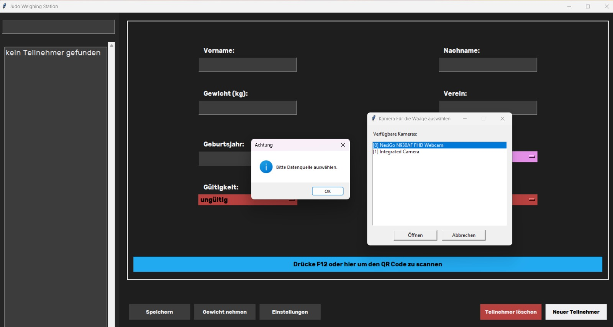
*Beim ersten Start fordert das System zur Auswahl von Datenquelle und Kameras auf.*

## 4. Die Hauptoberfläche

Die Oberfläche besteht aus zwei Bereichen:

- Links sehen Sie die Suche und die Teilnehmerliste.
- Rechts sehen Sie die Daten der aktuell ausgewählten Person.

Am unteren Rand befinden sich die wichtigsten Schaltflächen:

- `Speichern`
- `Gewicht nehmen`
- `Einstellungen`
- `Doppelstart` (nur wenn für das Geburtsjahr erlaubt)
- `Neuer Teilnehmer`
- `Teilnehmer löschen`

Außerdem sehen Sie unten im Datenbereich einen farbigen Hinweis zum QR-Scan. Ein Klick darauf löst denselben Vorgang aus wie `F12`.

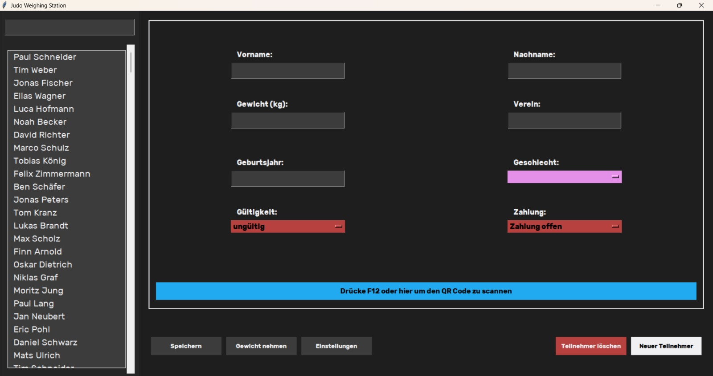
*Startbildschirm: Es wurde noch kein Teilnehmer ausgewählt.*

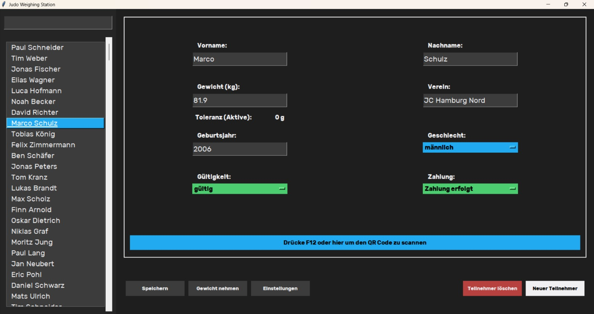
*Nach Auswahl eines Teilnehmers werden seine Daten rechts angezeigt.*

## 5. Erste Einrichtung

### 5.1 Datenquelle auswählen

Wenn noch keine Datenquelle ausgewählt wurde, öffnet das System die Einstellungen.

So gehen Sie vor:

1. Klicken Sie auf `Daten laden`.
2. Wählen Sie die Teilnehmerdatei mit der Endung `.json`.
3. Nach dem Laden erscheint der Inhalt in der Teilnehmerliste.

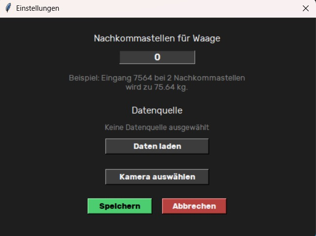
*Hier wählen Sie Datenquelle, Nachkommastellen und Kameraauswahl.*

### 5.2 Nachkommastellen der Waage einstellen

Im Feld `Nachkommastellen für Waage` legen Sie fest, wie die gemessene Zahl angezeigt wird.

Beispiel:

- Eingangswert `7564`
- bei `2` Nachkommastellen wird daraus `75.64 kg`

Diese Einstellung wirkt sich direkt auf die Anzeige im Gewichtsfenster und im Teilnehmerformular aus.

### 5.3 Kameras auswählen

Über `Kamera auswählen` bestimmen Sie, welche Kamera für welches Gerät verwendet wird.

Ablauf:

1. Klicken Sie auf `Kamera auswählen`.
2. Wählen Sie zuerst, ob Sie die Kamera für `Waage` oder `Scanner` setzen möchten.
3. Wählen Sie die gewünschte Kamera aus der Liste.
4. Das System prüft die Kamera automatisch.
5. Bestätigen Sie den Erfolgshinweis mit `OK`.

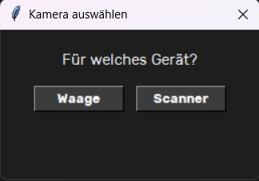
*Zuerst wählen Sie aus, ob die Kamera für die Waage oder für den Scanner gesetzt werden soll.*

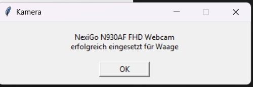
*Nach erfolgreicher Prüfung bestätigt das System die gewählte Kamera.*

## 6. Teilnehmer suchen oder per QR-Code finden

### 6.1 Suche über die linke Liste

Geben Sie oben links einen Suchbegriff ein. Das System sucht:

- nach Namen
- nach Vereinen
- auch bei kleinen Tippfehlern recht tolerant

Wenn nichts passt, erscheint in der Liste `kein Teilnehmer gefunden`.

### 6.2 QR-Code scannen

Es gibt zwei Wege, den QR-Scan zu starten:

- `F12` drücken
- auf den Hinweis `Drücke F12 oder hier um den QR Code zu scannen` klicken

Danach öffnet sich ein Scanfenster. Dort können Sie:

- einen QR-Handscanner verwenden
- den Code manuell einfügen
- mit `Enter` bestätigen
- auf `Mit Kamera scannen` klicken

`Esc` schließt das Scanfenster oder beendet den Kamerascan.

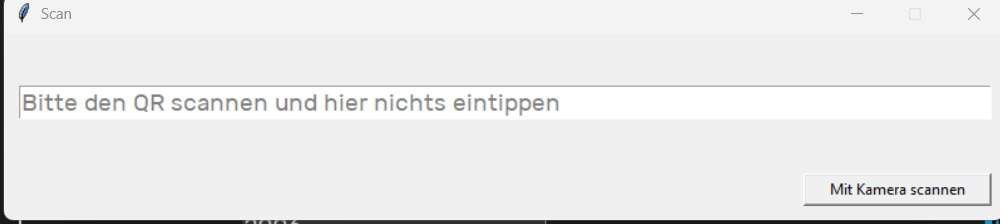
*Das Scanfenster nach `F12`.*

### 6.3 Was nach dem Scan passiert

Wenn der QR-Code eindeutig zu einer Person passt:

- wird die Person automatisch ausgewählt
- werden die Daten rechts angezeigt
- wird der Status `Gültigkeit` anhand des QR-Codes gesetzt

Wenn der QR-Code nicht eindeutig passt:

- filtert das System die Liste auf ähnliche Treffer
- zeigt eine Warnung an
- Sie müssen die richtige Person manuell auswählen oder die Daten manuell korrigieren

Wenn mehrere passende Personen gefunden werden, erscheint zusätzlich ein roter Hinweis `Achtung: Mehrere Personen gefunden`.

## 7. Gewicht aufnehmen

Wählen Sie zuerst einen Teilnehmer aus. Klicken Sie danach auf `Gewicht nehmen`.

Das System fordert die Waage zur Messung auf. Wenn ein Wert erkannt wurde, öffnet sich ein Bestätigungsfenster mit:

- Name der ausgewählten Person
- erkanntem Gewicht
- `OK`
- `Cancel`

Mit `OK` wird das Gewicht übernommen, in das Formular eingetragen und sofort gespeichert. Mit `Cancel` wird der Messwert verworfen.

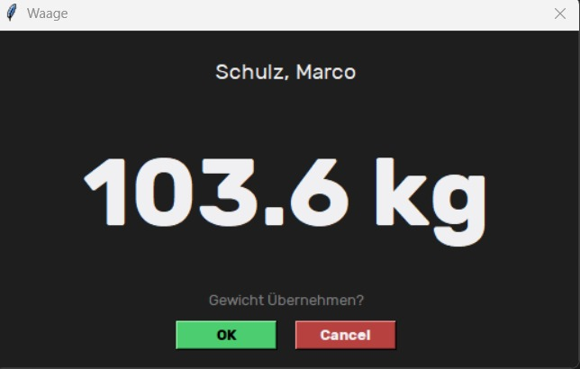
*Das erkannte Gewicht wird groß angezeigt und kann übernommen werden.*

## 8. Daten prüfen und speichern

Sie können die angezeigten Personendaten direkt im rechten Bereich ändern.

Bearbeitbar sind:

- Vorname
- Nachname
- Gewicht
- Verein
- Geburtsjahr
- Geschlecht
- Gültigkeit
- Zahlung

Zum Speichern können Sie:

- auf `Speichern` klicken
- `Ctrl+S` drücken

### 8.1 Gelbe Markierung

Wenn Sie etwas geändert haben, aber noch nicht gespeichert haben:

- wird die Umrandung gelb
- wird auch der Button `Speichern` gelb
- erscheint der Hinweis `Bitte speichern Sie die Änderungen`

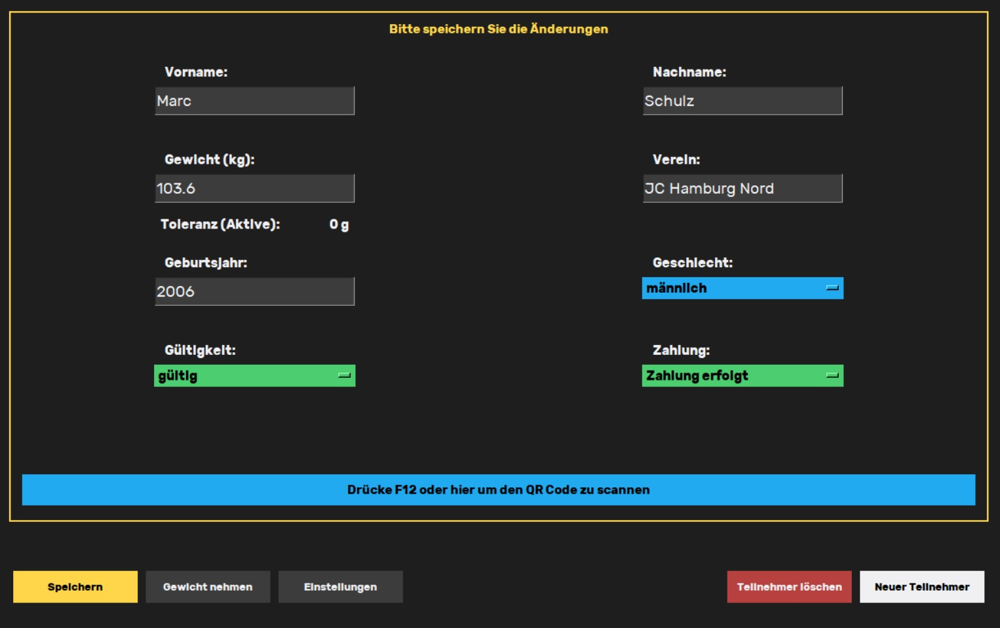
*Gelb bedeutet: Es gibt Änderungen, die noch nicht gespeichert wurden.*

### 8.2 Rote Markierung

Wenn ein Pflichtfeld leer oder ein Wert ungültig ist:

- wird die Umrandung rot
- wird auch der Button `Speichern` rot
- erscheint der Hinweis `Ein oder mehrere Einträge sind leer oder falsch`

Pflichtfelder sind:

- Vorname
- Nachname
- Verein
- Geburtsjahr
- Gewicht

Beim Geburtsjahr akzeptiert das System nur sinnvolle Jahreszahlen. Wenn das Jahr nicht erlaubt ist, erscheint eine Fehlermeldung.

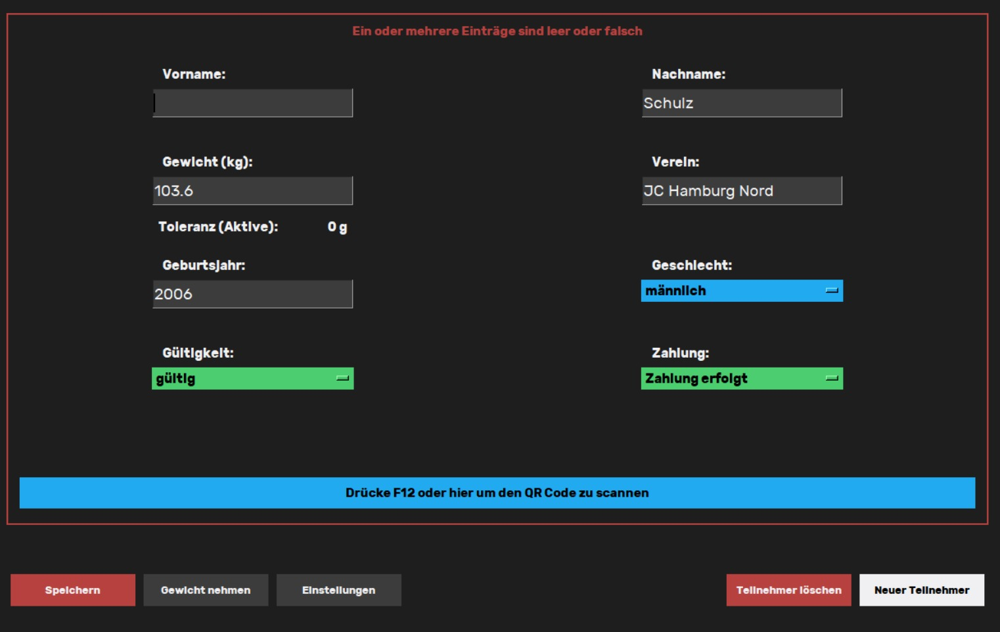
*Rot bedeutet: Die Eingabe ist unvollständig oder ungültig.*

### 8.3 Zusatzhinweise im Formular

Unter dem Gewichtsfeld kann ein Toleranzhinweis erscheinen. Dieser hängt von Geburtsjahr und Geschlecht ab, wenn Ihre Veranstaltungsdaten das unterstützen.

Der Button `Doppelstart` wird nur angezeigt, wenn das Geburtsjahr der Person dafür freigegeben ist. Im Fenster können Sie zwischen `standard`, `höher` und `doppel` wählen. Das System erklärt die fachliche Bedeutung dieser Optionen nicht selbst. Wählen Sie daher den Modus, der in Ihrer Veranstaltung vorgesehen ist.

## 9. Neuen Teilnehmer anlegen

Klicken Sie auf `Neuer Teilnehmer`.

Im Eingabefenster können Sie folgende Daten erfassen:

- Vorname
- Nachname
- Verein
- Geburtsjahr
- Geschlecht
- Gültigkeit
- Zahlung

Hinweise:

- Vorname und Nachname müssen ausgefüllt sein.
- Das Geburtsjahr wird geprüft.
- Wenn `Verein` leer bleibt, wird beim Speichern automatisch `Ohne Verein` gesetzt.

Wenn dieses Fenster geöffnet ist und Sie in dieser Zeit einen QR-Code scannen, füllt das System Vorname, Nachname und Geburtsjahr automatisch aus. Auch der Gültigkeitsstatus wird passend gesetzt.

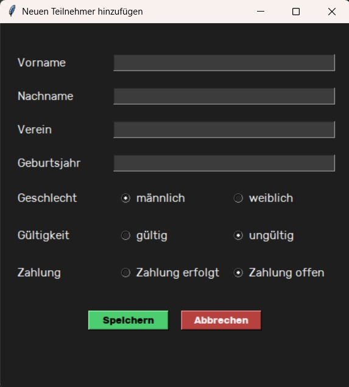
*Fenster zum manuellen Anlegen eines neuen Teilnehmers.*

## 10. Teilnehmer löschen

So löschen Sie einen Teilnehmer:

1. Teilnehmer links auswählen.
2. Auf `Teilnehmer löschen` klicken.
3. Sicherheitsabfrage mit `Ja` bestätigen.

Die Löschung ist endgültig. Der Eintrag wird direkt aus der gewählten Teilnehmerdatei entfernt.

## 11. Typische Meldungen und was zu tun ist

### `Bitte Datenquelle auswählen.`

Es ist noch keine Teilnehmerdatei geladen.

Lösung:

- `Einstellungen` öffnen
- `Daten laden` wählen
- richtige `.json`-Datei auswählen

### `Kamera wird bereits von einem anderen Programm verwendet`

Die Kamera ist belegt, zum Beispiel durch die Windows-Kamera-App, Teams oder ein anderes Programm.

Lösung:

- anderes Programm schließen
- Kamera erneut auswählen
- falls nötig die Wiegestation neu starten

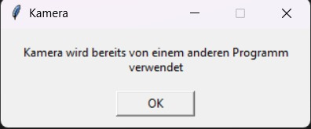
*Diese Meldung erscheint, wenn die Kamera gerade anderweitig benutzt wird.*

### `Fehler: Bitte Kamera anpassen`

Die Waagenkamera erkennt die Ziffern noch nicht sauber.

Lösung:

- Kamera auf die Anzeige der Waage ausrichten
- darauf achten, dass die roten Ziffern gut sichtbar sind
- mit `OK` erneut prüfen

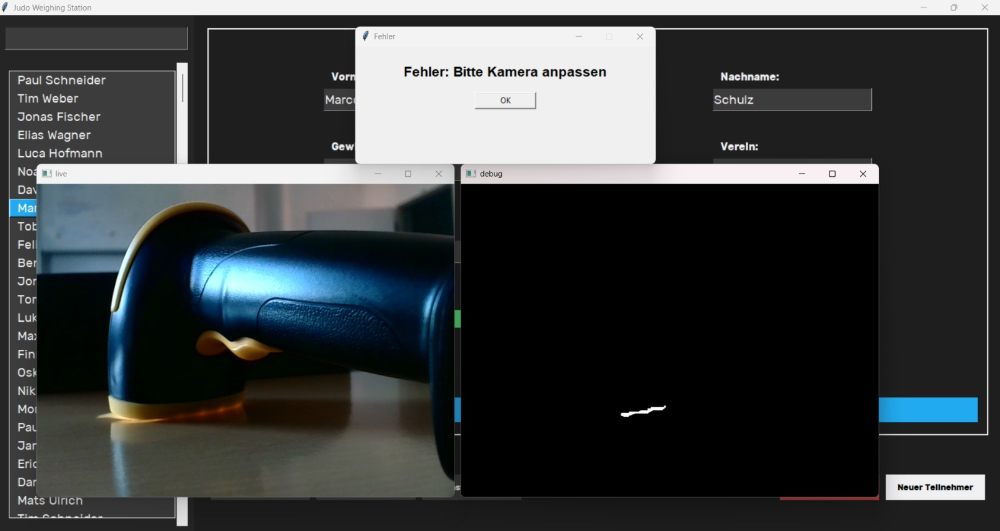
*Hier ist die Kamera noch nicht sauber auf die Anzeige ausgerichtet.*

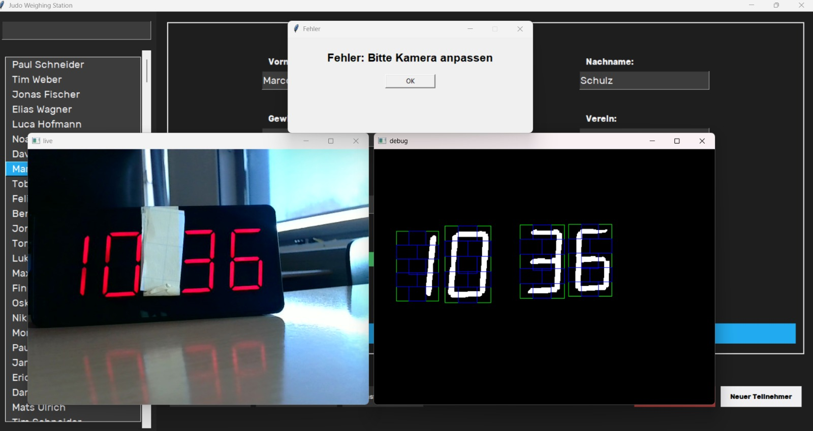
*Hier erkennt das System die Anzeige korrekt.*

### Kein eindeutiger QR-Treffer

Wenn kein vollständiger Treffer gefunden wird, zeigt das System ähnliche Personen und eine Warnung an.

Lösung:

- richtige Person manuell aus der Liste auswählen
- Daten prüfen
- bei Bedarf korrigieren und speichern

### Keine Person ausgewählt

Wenn Sie eine Gewichtsmessung ohne ausgewählte Person übernehmen wollen, ist der Ablauf nicht sinnvoll.

Lösung:

- zuerst die richtige Person auswählen
- danach erneut `Gewicht nehmen`

### `No scale client connected.`

Die Waagenkomponente ist nicht verbunden.

Lösung:

- prüfen, ob das Gesamtsystem vollständig gestartet wurde
- Anwendung bei Bedarf neu starten

## 12. Tastenkürzel

- `F12`: QR-Scan starten
- `Ctrl+S`: Änderungen speichern
- `Enter` im Scanfenster: eingelesenen QR-Inhalt übernehmen
- `Esc` im Scanfenster oder Kamerafenster: Scan abbrechen

## 13. Empfohlener Arbeitsablauf am Wiegetisch

1. Teilnehmer über Suche oder QR-Code finden.
2. Prüfen, ob rechts die richtige Person angezeigt wird.
3. Falls nötig Daten korrigieren.
4. Auf `Gewicht nehmen` klicken.
5. Gewicht mit `OK` übernehmen.
6. Prüfen, ob die Daten gespeichert wurden.
7. Nächsten Teilnehmer bearbeiten.

## 14. Beenden

Beenden Sie das System über das Hauptfenster der Anwendung. Dabei werden die zugehörigen Komponenten für Scanner und Waage ebenfalls geschlossen.
